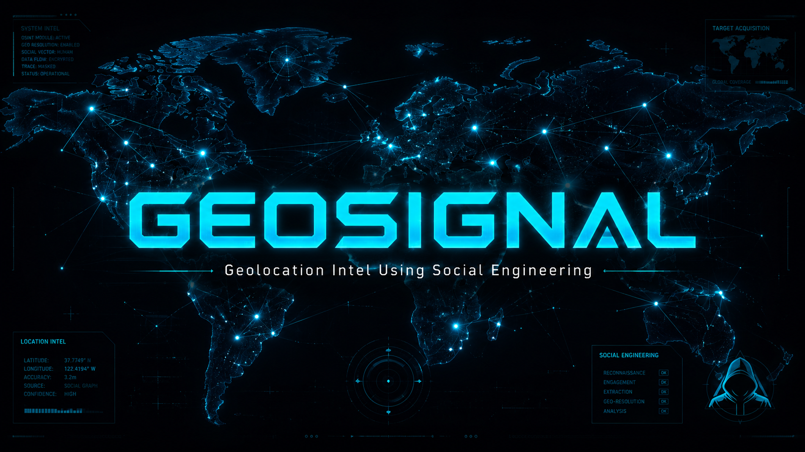
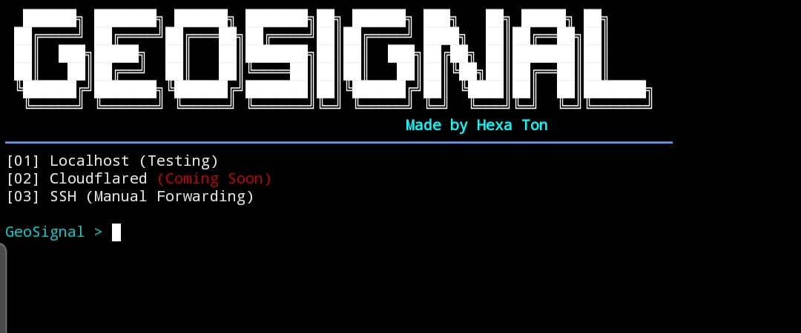

<p align="center">
  
</p>
# 🛰️ GeoSignal
**Advanced Geolocation Tracking Tool** with a High-Tech Terminal UI.

GeoSignal is a powerful Python-based tool designed to capture precise location data, device information, and browser signatures using social engineering techniques.

## 🚀 Features
* **Real-time Tracking:** Captures Latitude, Longitude, and Accuracy.
* **Device Info:** Logs OS details and Browser User-Agents.
* **High-Tech UI:** Premium Terminal Dashboard with military-grade design.
* **One-Click Maps:** Generates an instant Google Maps overlay.

## 🛠️ Installation
To install and run GeoSignal, execute these commands:

```bash
pkg install python git -y
git clone https://github.com/Hexa-Ton/GeoSignal
cd GeoSignal
pip install -r requirements.txt
chmod +x geosignal.py
python geosignal.py
```

## ⚠️ Disclaimer
This tool is for educational purposes and ethical security testing only. The author is not responsible for any misuse or illegal activities.

**Created by Hexa Ton 😈 **

---

<p align="center">
  
</p>
